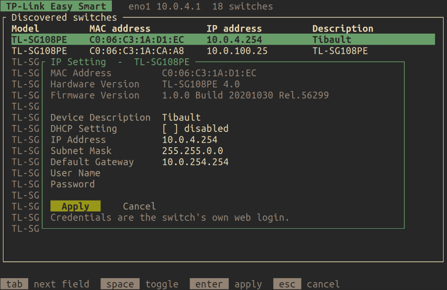

# tplink-easysmart

A terminal UI for TP-Link "Easy Smart" switches — TL-SG105E, SG108E, SG108PE
and relatives — replacing the vendor's JavaFX utility.

It covers the two things that utility is actually needed for: finding switches
on the wire and setting their address. Everything else (VLANs, QoS, port
mirroring, PoE) belongs to the switch's own web interface, which is one
keypress away.



## Running it

```sh
cargo build --release
./target/release/tplink-easysmart
```

| Option | |
|---|---|
| `-i`, `--interface <NAME>` | interface to search on (default: whichever carries the default route) |
| `-l`, `--list` | list candidate interfaces and exit |

## Keys

| Key | |
|---|---|
| `↑` `↓` / `j` `k` | select |
| `enter` / `s` | open IP settings |
| `w` | open the web UI in a browser |
| `r` | rescan |
| `?` | help |
| `q` | quit |

In the settings dialog, `tab` moves between fields, `space` toggles DHCP, and
the tab order ends on **Apply** / **Cancel**. `enter` applies from any field,
`esc` backs out. Applying asks for confirmation, then writes the change and
saves it to flash.

## Things worth knowing

Switches that are not on the host's subnet — typically still on the factory
`192.168.0.1` — are shown dimmed. They are discoverable, because discovery is
broadcast-based, but not reachable over IP: give them an address first, and the
web UI stays unavailable until you do.

Applying a change needs the switch's own web login. Those credentials cross the
network in cleartext, which is a property of the protocol rather than of this
tool — see [PROTOCOL.md](PROTOCOL.md#security).

## The protocol

Undocumented, and reconstructed here from the vendor binary: header layout,
TLV types, the RC4 obfuscation, and the single-use token that gates every
write. Written up in **[PROTOCOL.md](PROTOCOL.md)**.
